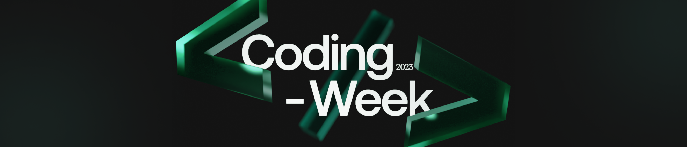

# Open Source Module

Greetings🎉!

We hope you have gone through the resources and understood the basics of Git and GitHub which is essential for contributing to open source projects
Now it's time to test your understanding through a task. The task has been divided into 3 subtasks with increasing level of difficulty. The points associated with the tasks also increase proportionately with their difficulty.

Also note that it is not mandatory to attempt all the subtasks. You can attempt whichever task you want. However, attempting more tasks will increase your chances of selection for interviews.

## Sub Task 1 :

- Create a repository on your local machine and then push it to your GitHub account. Make sure that your repository is public (and not private). Now add a basic README to the repository. In the README add your details like name roll number branch etc.  Also add a brief description about yourself. Push the changes to your repository.

- Create a new branch in your repository. Edit your README by adding a few lines about why you want to contribute to open source. Commit these changes to the branch. Merge the two branches.

     Note : You need to record your screen while doing the second part from Sub Task 1. Also introduce yourself in the beginning of the video.

## Sub Task 2:

- Fork and clone the repo from the [Coding Club](https://github.com/Coding-Club-IITG/Open-Source-Tasks-2023) GitHub Account. In the repository there will be a folder sub2-1 go inside template hello world program with a name `hello.cpp`. In the existing template change `world` to (your name | your roll number) then push the changes to your branch and create a pull request with subject `subtask2-1/added-information`

- In the repository there will be a folder sub2-2. You can see there are three files `index.html`, `style.css`, `script.js` and a folder `images`. Here can download an extension `live server` if you are using `vs code` or just can open the file `index.html` on your browser to see the output. To see the task you have to navigate to `script.js` file. Now create an issue on the [main repo](https://github.com/Coding-Club-IITG/Open-Source-Tasks-2023) and descripe the issue as given inside `script.js` file. After doing the changes push it on your branch and make a pull request. While making the pull request link the issue you created earlier with your pull request and give the subject `subtask2-2/solved-issue`

    Note : While staging the file with command `git add`, make sure you only add the file that you want to add. The task 2 for this subtask is not mandotory however attempting this will give you an edge over others.

## Sub Task 3:
Create a [Github Action](https://docs.github.com/en/actions) in a new repository demonstrating a simple and creative workflow. It's upto the participants on what they want to build. For this task, participants will be judged on the creativity of the workflow they will implement with Github Action.

Examples:
- A action which adds patience quotes/memes in every new PR created
- A action which updates blog links on your github profile page on every new commit

You can also create useful github action for proper deployment or CI/CD.

Try to be as creative as possible ;)

## Note:

Though doing all the tasks is not necessary, the more you will attempt the better the chances will be of getting higher points from Heads.
